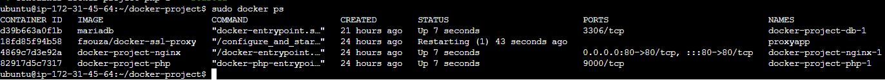

<div id="top"></div>

<p align="center">
    
</p>

<h1 align="center"># AWS Setup with Docker for an Optimized Website</h1>

<div align="center">

<br>


[](https://opensource.org/licenses/MIT)

<h4 align="center">Welcome to the AWS Setup with Docker for an Optimized Website! In this guide, you'll embark on a journey to configure a robust AWS environment using Docker, Nginx, PHP, and MariaDB. Follow these comprehensive steps to deploy your stunning website and harness the power of cloud infrastructure.</h4>

</div>

<!-- TABLE OF CONTENTS -->
<details href="#index">
  <summary>Table of Contents</summary>
  <ol>
    <li><a href="#initial-configuration">Initial Configuration</a></li>
    <li><a href="#add-nginx-and-ssl">Add Nginx and SSL</a></li>
    <li><a href="#configure-php">Configure PHP</a></li>
    <li><a href="#container">Container</a></li>
    <li><a href="#last-step-configure-mariadb">Last Step: Configure MariaDB</a></li>
    <li><a href="#how-to-update-the-repo-on-aws">How to Update the Repo on AWS</a></li>
    <li><a href="#license">License</a></li>
    <li><a href="#contact">Contact</a></li>
  </ol>
</details>

<!-- START -->
## Initial configuration

You need to install both docker and docker-compose.

Follow the following commands:

1. Update your package index:
   ```bash
   sudo apt update
   ```
2. Install Docker Engine
   ```bash
   sudo apt install -y docker.io
   ```
3. Enable docker correctly
   ```bash
   sudo systemctl enable docker
   ```
4. Install docker-compose 
   ```bash
   sudo curl -L "https://github.com/docker/compose/releases/latest/download/docker-compose-$(uname -s)-$(uname -m)" -o /usr/local/bin/docker-compose
   ```
5. Add the chmod command to grant execute permissions
   ```bash
   sudo chmod +x /usr/local/bin/docker-compose
   ```

Then create the project folder:
* ```bash
   mkdir ~/docker-project
   ```
* ```bash
   cd ~/docker-project
   ```

You can of course call it whatever you want.

<p align="right">(<a href="#top">back to top</a>)</p>


<!-- NGINX SSL -->
## Add Nginx and SSL

After creating the folder, we create the docker-compose.yml file inside, which will be used to initially launch the nginx container.


* Create the file
  ```bash
   sudo nano docker-compose.yml
   ```
* Copy the code and put it in
  ```bash
   version: "3.9"
   services:
        nginx:
          image: nginx:latest
          container_name: nginx-container
          ports:
           - 80:80
   ```
  
Start the nginx container via the `docker-compose up -d` command, giving permissions with sudo.

* Create the certificate in the ssl folder with the command:
  ```bash
   mkdir ~/ssl 
   ```
* Generate self-signed SSL certificate and key (you will be asked some information for the certificate):
  ```bash
   sudo openssl req -x509 -nodes -days 365 -newkey rsa:2048 -keyout ~/ssl/key.pem -out ~/ssl/cert.pem
   ```
* To connect it to the nginx container:
  ```bash
   sudo docker run -d --name proxyapp --network docker-project_default -p 443:443 -e DOMAIN=*.compute-1.amazonaws.com -e TARGET_PORT=80 -e TARGET_HOST=docker-project-nginx-1 -e SSL_PORT=443 -v ~/ssl:/etc/nginx/certs --restart unless-stopped fsouza/docker-ssl-proxy
   ```
  
<p align="right">(<a href="#top">back to top</a>)</p>


<!-- PHP -->
### Configure PHP 

1. Create PHP folder (the repo is saved here):
   ```bash
   mkdir ~/docker-project/php_code
   ```
2. Clone the repo:
   ```sh
   git clone https://github.com/NicoMezzaa/AWS-Project ~/docker-project/php_code/
   ```
3. Create a file called _Dockerfile_ in the php_code folder:
    ```sh
    FROM php:7.0-fpm
    RUN docker-php-ext-install mysqli pdo pdo_mysql
    RUN docker-php-ext-enable mysqli
    ```
4. Create a directory for Nginx inside your project directory:
    ```sh
    mkdir ~/docker-project/nginx
    ```
5. Create an Nginx default configuration file to run your PHP application
    ```sh
    sudo nano ~/docker-project/nginx/default.conf
    ```
6. Add the following Nginx configuration to the _default.conf_ file:
    ```sh
    server {  

     listen 80 default_server;  
     root /var/www/html;  
     index index.html index.php;  

     charset utf-8;  

     location / {  
      try_files $uri $uri/ /index.php?$query_string;  
     }  

     location = /favicon.ico { access_log off; log_not_found off; }  
     location = /robots.txt { access_log off; log_not_found off; }  

     access_log off;  
     error_log /var/log/nginx/error.log error;  

     sendfile off;  

     client_max_body_size 100m;  

     location ~ .php$ {  
      fastcgi_split_path_info ^(.+.php)(/.+)$;  
      fastcgi_pass php:9000;  
      fastcgi_index index.php;  
      include fastcgi_params;
      fastcgi_read_timeout 300;
      fastcgi_param SCRIPT_FILENAME $document_root$fastcgi_script_name;  
      fastcgi_intercept_errors off;  
      fastcgi_buffer_size 16k;  
      fastcgi_buffers 4 16k;  
    }  

     location ~ /.ht {  
      deny all;  
     }  
    }
    ```
7. Create a Dockerfile inside the nginx directory to copy the Nginx default config file:
    ```sh
    sudo nano ~/docker-project/nginx/Dockerfile
    ```
8. Add the following lines to the Dockerfile:
    ```sh
    FROM nginx
    COPY ./default.conf /etc/nginx/conf.d/default.conf
    ```
9. Update the _docker-compose.yml_ file with the following contents:
    ```sh
    version: "3.9"
    services:
       nginx:
         build: ./nginx/
         ports:
           - 80:80
      
         volumes:
             - ./php_code/:/var/www/html/
    
       php:
         build: ./php_code/
         expose:
           - 9000
         volumes:
            - ./php_code/:/var/www/html/
    ```
10. Then launch the containers:
    ```sh
    sudo docker-compose up -d
    ```
11. See the containers:
    ```sh
    sudo docker ps
    ```

<p align="right">(<a href="#top">back to top</a>)</p>


<!-- CONTAINER -->
## Container


<p align="right">(<a href="#top">back to top</a>)</p>


<!-- MARIADB -->
### Last step: configure MariaDB

The last step now is to set up the container for the database

1. Update the _docker-compose.yml_ with this:
   ```sh
    version: "3.9"
    services:
       nginx:
         build: ./nginx/
         ports:
           - 80:80
      
         volumes:
             - ./php_code/:/var/www/html/
    
       php:
         build: ./php_code/
         expose:
           - 9000
         volumes:
            - ./php_code/:/var/www/html/
    
    
       db:    
          image: mariadb  
          volumes: 
            -    mysql-data:/var/lib/mysql
          environment:  
           MYSQL_ROOT_PASSWORD: mariadb
           MYSQL_DATABASE: AWS
    
    
    volumes:
        mysql-data:
   ```
2. Then launch the containers:
    ```sh
    sudo docker-compose up -d
    ```
3. Create the CLI inside MariaDB:
   ```sh
   sudo docker exec -it docker-project-db-1 /bin/sh
   ```
4. Access MariaDB as the root user:
   ```sh
   mariadb -u root -pmariadb
   ```
5. Create a user for the db:
   ```sh
   CREATE USER 'nicolo'@'%' IDENTIFIED BY "mezza";
   ```
6. Grant him privileges:
   ```sh
   GRANT ALL PRIVILEGES ON *.* TO 'nicolo'@'%';
   ```
7. Reload the privilege tables in the active memory:
   ```sh
   FLUSH PRIVILEGES;
   ```
8. To create a new db first repeat steps 3 and 4, then:
   ```sh
   CREATE DATABASE site;
   ```
9. Use database _site_:
   ```sh
   USE site;
   ```
10. Result:
    ```sh
    MariaDB [site]>
    ```
11. Run SQL commands:
    ```sh
    CREATE TABLE users (username VARCHAR(30) NOT NULL, password VARCHAR(32) NOT NULL);
    ```

<p align="right">(<a href="#top">back to top</a>)</p>


<!-- GIT PULL -->
## How to update the repo on AWS

1. Move to the folder where the repo is located:
    ```sh
    cd docker-project/php_code/
    ```
2. Do the _git pull_:
    ```sh
    git pull
    ```
Now, after setting everything up, check if it works and now you can focus on developing the site on AWS using the main development techniques:

* [HTML](https://developer.mozilla.org/en-US/docs/Web/HTML)
* [CSS](https://developer.mozilla.org/en-US/docs/Web/CSS)
* [JavaScript](https://developer.mozilla.org/en-US/docs/Web/JavaScript)
* [Bootstrap](https://getbootstrap.com/)
 
<p align="right">(<a href="#top">back to top</a>)</p>


<!-- LICENSE -->
## License

Distributed under the MIT License. See `LICENSE` for more information.

<p align="right">(<a href="#top">back to top</a>)</p>


<!-- CONTACT -->
## Contact

Nicolò Mezzanzanica - [](https://instagram.com/nicomezzaa) - nico.mezza7@gmail.com

Project Link (GitHub):    [](https://github.com/NicoMezzaa/AWS-Project)

<p align="right">(<a href="#top">back to top</a>)</p>


<!-- MARKDOWN LINKS & IMAGES -->
<!-- https://www.markdownguide.org/basic-syntax/#reference-style-links -->
[contributors-shield]: https://img.shields.io/github/contributors/othneildrew/Best-README-Template.svg?style=for-the-badge
[contributors-url]: https://github.com/othneildrew/Best-README-Template/graphs/contributors
[forks-shield]: https://img.shields.io/github/forks/othneildrew/Best-README-Template.svg?style=for-the-badge
[forks-url]: https://github.com/othneildrew/Best-README-Template/network/members
[stars-shield]: https://img.shields.io/github/stars/othneildrew/Best-README-Template.svg?style=for-the-badge
[stars-url]: https://github.com/othneildrew/Best-README-Template/stargazers
[issues-shield]: https://img.shields.io/github/issues/othneildrew/Best-README-Template.svg?style=for-the-badge
[issues-url]: https://github.com/othneildrew/Best-README-Template/issues
[license-shield]: https://img.shields.io/github/license/othneildrew/Best-README-Template.svg?style=for-the-badge
[license-url]: https://github.com/othneildrew/Best-README-Template/blob/master/LICENSE.txt
[linkedin-shield]: https://img.shields.io/badge/-LinkedIn-black.svg?style=for-the-badge&logo=linkedin&colorB=555
[linkedin-url]: https://linkedin.com/in/othneildrew
[product-screenshot]: images/screenshot.png
[Next.js]: https://img.shields.io/badge/next.js-000000?style=for-the-badge&logo=nextdotjs&logoColor=white
[Next-url]: https://nextjs.org/
[React.js]: https://img.shields.io/badge/React-20232A?style=for-the-badge&logo=react&logoColor=61DAFB
[React-url]: https://reactjs.org/
[Vue.js]: https://img.shields.io/badge/Vue.js-35495E?style=for-the-badge&logo=vuedotjs&logoColor=4FC08D
[Vue-url]: https://vuejs.org/
[Angular.io]: https://img.shields.io/badge/Angular-DD0031?style=for-the-badge&logo=angular&logoColor=white
[Angular-url]: https://angular.io/
[Svelte.dev]: https://img.shields.io/badge/Svelte-4A4A55?style=for-the-badge&logo=svelte&logoColor=FF3E00
[Svelte-url]: https://svelte.dev/
[Laravel.com]: https://img.shields.io/badge/Laravel-FF2D20?style=for-the-badge&logo=laravel&logoColor=white
[Laravel-url]: https://laravel.com
[Bootstrap.com]: https://img.shields.io/badge/Bootstrap-563D7C?style=for-the-badge&logo=bootstrap&logoColor=white
[Bootstrap-url]: https://getbootstrap.com
[JQuery.com]: https://img.shields.io/badge/jQuery-0769AD?style=for-the-badge&logo=jquery&logoColor=white
[JQuery-url]: https://jquery.com 
